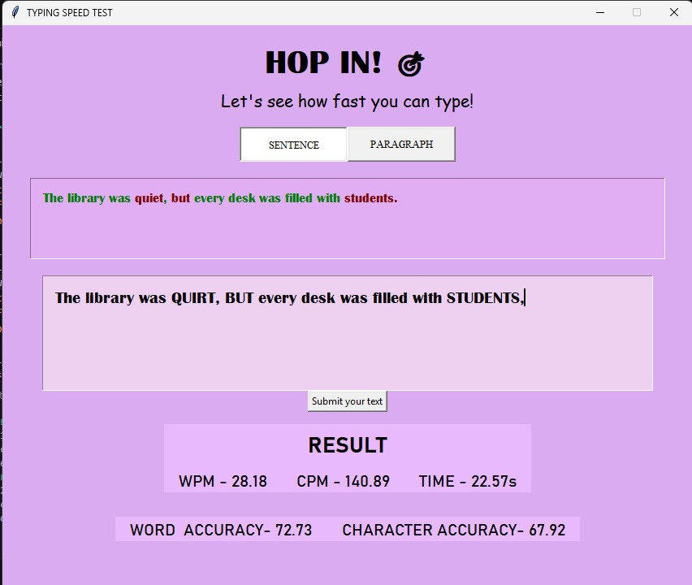
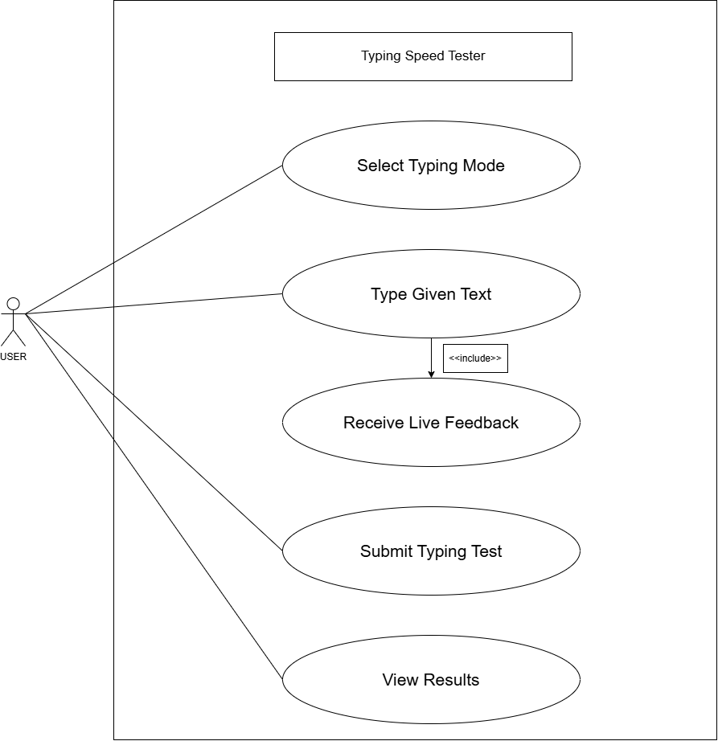

# Typing Speed Tester 

It is a simple Python program using Tkinter for the GUI. It helps users check their typing speed and see how accurate they are while typing.

## Features

- Sentence and paragraph typing modes
- Random typing text
- Automatic typing timer
- Live correct/wrong character feedback
- WPM and CPM calculation
- Word and character accuracy
- Simple Tkinter desktop interface
- Works offline

## Technologies Used

- Python
- Tkinter
- Pillow (PIL) - used for handling images in the GUI
- Git and GitHub

## How to Run

1. Make sure Python is installed on your computer.
2. Clone or download this repository.
3. Open the project folder in VS Code or a terminal.
4. Run the following command:

```bash
python typespeedmain.py
```
5. The Typing Speed Tester window will open.

## Testing 

The project was tested by running the application locally and checking:

- Sentence and paragraph selection
- Typing input and live character feedback
- Timer functionality
- WPM and CPM calculation
- Word and character accuracy calculation
- Different typing inputs and outputs

## Project Structure

```text
typespeed/
├── typespeedmain.py
├── test_data.py
├── statement.md
├── README.md
└── screenshotspeedtest.jpeg
```
## Screenshot 



## Diagrams

### Use Case Diagram



### Workflow Diagram

